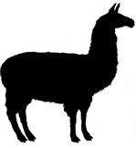

#  LAMATH 

## Linear Algebra Math Library for Javascript/Typescript 

LAMATH is a basic linear algebra library designed to be used with WebGL and Typescript. However, 
the library does not depend on either, so it can be added to any JS/TS project that needs to do 
vector math calculations.

Performance, simplicity, and generality are the main design goals of the library. Vectors and matrices 
are defined simply as arrays of numbers, no wrapper objects are used. This minimizes the number of 
allocations and alleviates GC pressure. If required, it is possible also to reuse the vector/matrix
arrays by explicitly specifying the result of the operations.

<!--
  Testing testing...
-->
